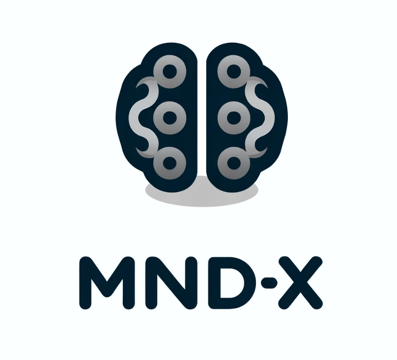
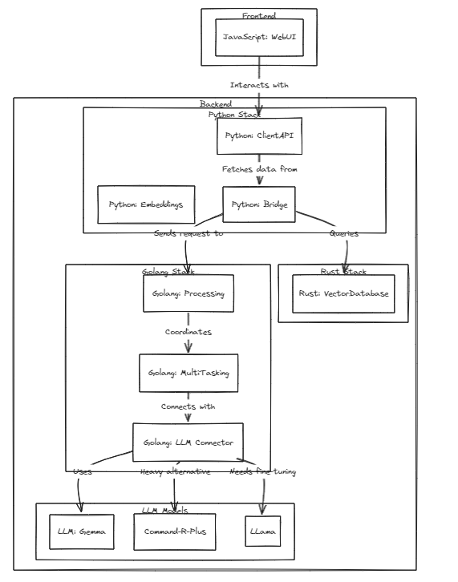
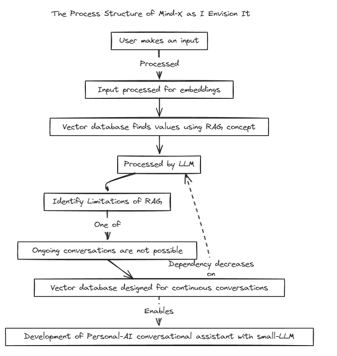
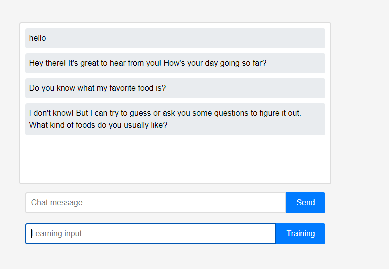
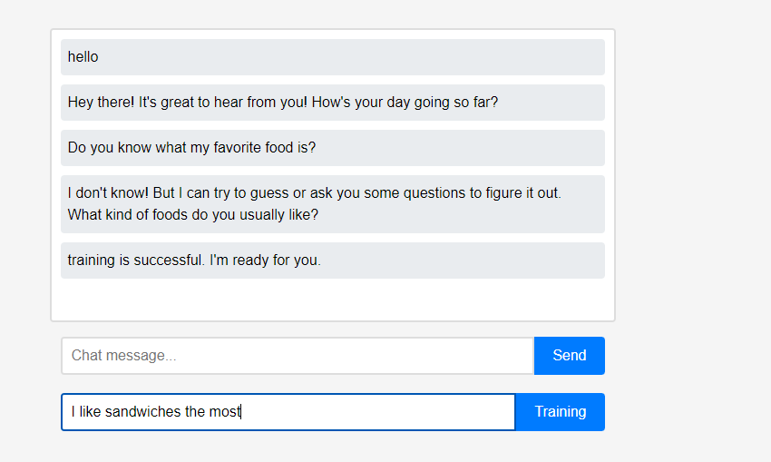
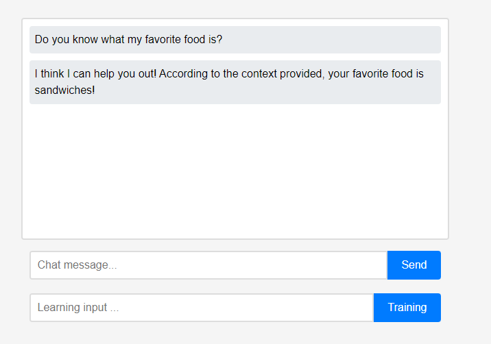

# MIND-X



## Mind-X is the fastest growing Smart CloneAI that understands 'me' in real time.

This project demonstrates the feasibility of personalized LLMs (or LMMs) as personal assistants, keeping pace with the rapid growth of these models.

We have introduced a Retrieval-Augmented Generation (RAG) method to overcome the limitations of traditional Prompt-Tuning, which has context boundaries, and Fine-Tuning, which suffers from issues with real-time data updates and hallucinations.

Traditionally, RAG has been used to search databases like Chroma via LangChain as a store, but this method operates within fixed contexts, which is limiting.

Therefore, we plan to build our own RAG system. This process may involve addressing inference and regression issues that LangChain might offer.

We are committed to rapid development and will soon enable multilingual compatibility. Currently, the system fully supports English, with plans to support Korean, Japanese, and other languages shortly. Additionally, regression and inference systems will also be incorporated soon.

## Architecture




## Running Tests

To run tests, run the following command

```bash
#start embeddings server
  cd embd & pip install -r requirements.txt
  python app.py

#start mindx-v server (vector-database)
#not using cgo, only assembly
cd mindx-v & go run cmd/mxvd/main.go

#start processor server
cd processor & go run cmd/main.go

#start demo client
cd sample_client & npm start

```

## Demo


Initially, the assistant knows nothing about the user.

However, users can teach the assistant about themselves in real-time.

(Due to the characteristics of LLM, it could be misunderstood that it was remembered as a conversation chain rather than learning, so it was done after refreshing.) The learned data was immediately reflected, and this can be seen as the assistant's first personalization.

All these features of the project can be supported locally without the need for external cloud integration or an internet connection.

## Contact

- Please contact me at kn2414e@gmail.com.
- This project is available for everyone to use, and while there is no intention to monetize it, if you wish to commercialize it or conduct internal testing, please disclose your company name to assist me.
